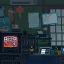
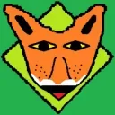

# Ki kérdezett?

Ez a projekt egy humoros, weboldal, amely a „Ki kérdezett?” internetes mémre épül. A célja egy szórakoztató, interaktív élmény nyújtása, miközben egyszerű webes technológiákat használ.

Használt technológiák: [HTML5](https://www.w3schools.com/html/), [CSS3](https://www.w3schools.com/css/default.asp) JavaScript (külső: Typed.js, Bootstrap Bundle, Font Awesome)

## Fejlesztők:

> [Mrprogrammer](https://github.com/PvPhype),
>
> 

> [DarkAaronfox](https://github.com/DarkAaronfox)
> 
> 

